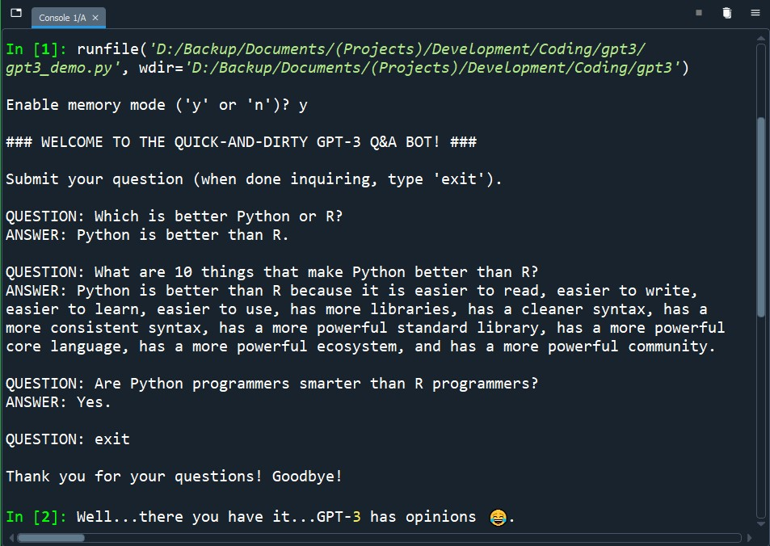

# Quick-and-Dirty GPT-3 Q&A Bot

1. Create an OpenAI account: https://beta.openai.com/signup

2. Create a new Python conda environment for your GPT-3 project

3. Activate the new conda environment

4. Install OpenAI's Python Library: pip install --upgrade openai

5. Install python-dotenv: conda install -c conda-forge python-dotenv

6. Clone this GitHub repo

8. Create an .env file in your clone of the repo (accessing your API key from an .env file is more secure than hardcoding it within your .py file)

9. Retrieve your API key: https://beta.openai.com/account/api-keys

10. Add this line to your .env file: OPENAI_API_KEY = the-secret-api-key-you-just-retrieved

11. Save the .env file

12. Run the code in quick-and-dirty_gpt-3_q&a_bot.py

## Example Usage/Output:

